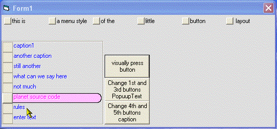



## LittleButton\.ocx    allows you to instantly create a button array \(up to 20 elements\) AND\.\.\.\.\.\.\.\.\.\.\.

### Description

LittleButton.ocx is a one of a kind button that is actually many buttons in one. Instantly creates and array of buttons(up to 20 elements). The buttons can be arranged vertically or horizontally (menu style) Just about every visual aspect of the control is totally customizable from the caption style(flat, embossed, shadow, raised) to the mouse over hilite color, and more than 2 dozen additional properties. One look at the screensh0t will convince you of just how much time and work was put into this.
 
### More Info
 

             |
---                |---
**Submitted On**   |2005-02-07 22:00:08
**By**             |[Evan Toder](https://github.com/Planet-Source-Code/PSCIndex/blob/master/ByAuthor/evan-toder.md)
**Level**          |Intermediate
**User Rating**    |5.0 (15 globes from 3 users)
**Compatibility**  |VB 3\.0, VB 4\.0 \(16\-bit\), VB 4\.0 \(32\-bit\), VB 5\.0, VB 6\.0
**Category**       |[Custom Controls/ Forms/  Menus](https://github.com/Planet-Source-Code/PSCIndex/blob/master/ByCategory/custom-controls-forms-menus__1-4.md)
**World**          |[Visual Basic](https://github.com/Planet-Source-Code/PSCIndex/blob/master/ByWorld/visual-basic.md)
**Archive File**   |[LittleButt184987272005\.zip](https://github.com/Planet-Source-Code/evan-toder-littlebutton-ocx-allows-you-to-instantly-create-a-button-array-up-to-20-element__1-58773/archive/master.zip)

